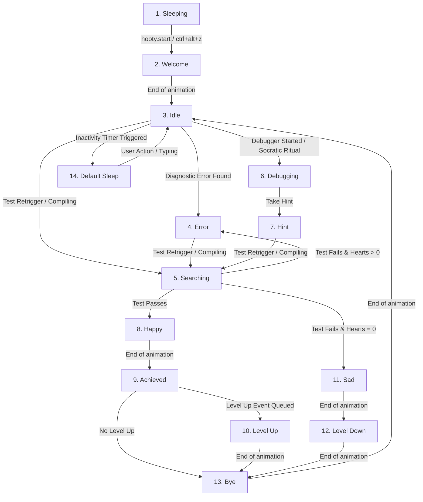

# Hooty the Knowledge Owl — Animation Flow and Integration Plan

This plan details the implementation of a sequential, state-machine-driven character animation system for the VS Code companion, **Hooty the Knowledge Owl**. Hooty is a curious, friendly companion who loves to learn new things, guide users, and share helpful tips. All duck-related references are replaced with Hooty owl content.

---

## State Machine & Flow Mapping

We will implement the following character states, mapped exactly to the animation flowchart:

### Excluded Optional States (As annotated in flowchart)
- **Explanation (Optional)**: Marked as *FOR NOW KEEP DONT USE*.
- **Optional for now don use** (after Achieved): Marked as *DONT USE*.
- **Better try next**: Marked as *OPTIONAL DONT USE FOR NOW*.
- **No error when file is compiled**: Marked as *OPTIONAL FOR NOW DONT USE* (falls back directly to `Idle`).

---

## Rebranded Voice and Text Dialogue Mapping

To make Hooty feel like a real owl companion, each state change triggers a **synchronized text dialogue popup** and a **speech synthesis voice line**:

| Character State | Voice Line (Text-to-Speech) | Speech Bubble Text |
| :--- | :--- | :--- |
| **1. Sleeping** | *(Soft breathing / Silent)* | "Zzz... (Press Ctrl+Alt+Z to wake Hooty up!)" |
| **2. Welcome** | "Hoot hoot! Hello there! I'm awake and ready to explore your code." | "Hoot hoot! Hello there! I'm awake and ready to explore! 🦉" |
| **3. Idle** | *(None, standard idle stance)* | *(None, bubble hidden unless chatting)* |
| **4. Error** | "Hoot! I spotted an interesting error. Let's inspect it!" | "Hoot! I spotted an error. Let's look at the diagnostics! 🧐" |
| **5. Searching** | "Analyzing your code and running verification tests... Let's see what happens!" | "Analyzing and verifying tests... ⚙️" |
| **6. Debugging** | "Starting a Socratic challenge! Let's solve this mystery together." | "Socratic Debugging Session active! 🦉" |
| **7. Hint** | "Here is a curious insight to guide you. Take a close look." | "💡 Owl Hint: [Hint Content]" |
| **8. Happy** | "Amazing! The code compiles flawlessly! That was a smart fix." | "Flawless compilation! Great job! 🎉" |
| **9. Achieved** | "Hoot! Milestone achieved! We're learning so much together." | "Milestone Achieved! +XP 🏆" |
| **10. Level Up** | "Splendid! You leveled up! Your programming knowledge is expanding." | "LEVEL UP! New rank unlocked! ⭐" |
| **11. Sad** | "Hoot... the tests are still failing after all attempts. Let's study the solution." | "Attempts depleted... 🦉" |
| **12. Level Down** | "Ah, milestone failed. Let's examine the solution to learn from it!" | "Milestone failed. Let's study the solution!" |
| **13. Bye** | "Back to standby. I'm here whenever you need a tip!" | "Standby active. Ready to guide! 🦉" |
| **14. Default Sleep**| "Yawn... I'm going to take a quick rest. Wake me up when you need some tips!"| "Going to sleep... Zzz... 💤" |

---

## User Review Required

> [!IMPORTANT]
> **Animation Directories and Naming Convention**
> Once this plan is approved, you will place your frames in the rebranded `media/hooty/` directory under subfolders corresponding to the state names.
> 
> The folders should be structured as follows:
> - `media/hooty/sleeping/`
> - `media/hooty/welcome/`
> - `media/hooty/idle/`
> - `media/hooty/error/`
> - `media/hooty/searching/`
> - `media/hooty/debugging/`
> - `media/hooty/hint/`
> - `media/hooty/happy/`
> - `media/hooty/achieved/`
> - `media/hooty/level_up/`
> - `media/hooty/sad/`
> - `media/hooty/level_down/`
> - `media/hooty/bye/`
> - `media/hooty/default_sleep/`
> 
> Inside each folder, frames should be named sequentially (e.g., `01.png`, `02.png` or `frame_01.svg`, `frame_02.svg`). The extension will automatically detect file counts and formats dynamically.

---

## Proposed Changes

### 1. File & Directory Restructuring
- **Rename/Move**: Copy assets and template files from `media/duck/` to a new folder `media/hooty/`.
- **Remove**: Clean up the legacy `media/duck/` directory to completely eliminate duck assets.

### 2. Extension Host / VS Code Integration

#### [MODIFY] [DuckViewProvider.ts](file:///c:/Users/Tanish/Desktop/eXtension/Saarthi/src/ui/DuckViewProvider.ts) (Or refactored to `HootyViewProvider.ts`)
- Rename the class to `HootyViewProvider` (registered under view type `hootyView`).
- Update `_getHtmlForWebview` to dynamically read frames from `media/hooty/` and support both PNG and SVG formats.
- Expose methods to send Hooty-branded messages to the webview.

#### [MODIFY] [sidebar.ts](file:///c:/Users/Tanish/Desktop/eXtension/Saarthi/src/ui/sidebar.ts)
- Update Socratic state integrations to use `HootyViewProvider.instance`.
- Coordinate compilation (`searching`), Socratic sessions (`debugging`), hints (`hint`), successes (`happy` -> `achieved`), and failures (`sad` -> `level_down`) state transmissions.

#### [MODIFY] [extension.ts](file:///c:/Users/Tanish/Desktop/eXtension/Saarthi/src/extension.ts)
- Rename registered command `duck.start` to `hooty.start` (mapped to `ctrl+alt+z`).
- Initialize `HootyViewProvider` and setup diagnostics, debug, and rank-up event handlers.

#### [MODIFY] [package.json](file:///c:/Users/Tanish/Desktop/eXtension/Saarthi/package.json)
- Rename command contributions: `duck.start` -> `hooty.start` ("Start Hooty NPC").
- Rename views container: "Duck" -> "Hooty", and view name "Duck Companion" -> "Hooty Companion".

### 3. Backend Integration

#### [MODIFY] [groq_service.py](file:///c:/Users/Tanish/Desktop/eXtension/Saarthi/backend/services/groq_service.py)
- Rebrand LLM prompt instructions:
  - Change prompt from "friendly yellow duck companion named Ducky" to **"Hooty, a curious, friendly, and knowledgeable owl programming companion who loves learning, sharing helpful tips, and making coding smart and fun. Use owl emojis (🦉) and clever hoot-themed puns."**

### 4. Webview Frontend

#### [MODIFY] [webview.html](file:///c:/Users/Tanish/Desktop/eXtension/Saarthi/media/hooty/webview.html)
- Change logo/badges from "🦆 Ducky" to "🦉 Hooty".
- Update container/image element IDs from `duck-container`, `duck-bubble` to `hooty-container`, `hooty-bubble`.
- Rebrand help strings and overlays.

#### [MODIFY] [webview.js](file:///c:/Users/Tanish/Desktop/eXtension/Saarthi/media/hooty/webview.js)
- Modify the animation player to play sequentially **without looping** (holds on the last frame).
- Implement the auto-transition mapping flow (`happy` -> `achieved` -> `level_up`/`bye` -> `bye` -> `idle`).
- Implement inactivity sleep timer (plays sleep message after 2 minutes of idle time).
- Integrate voice/TTS dialogue lines matching Hooty's curious personality.

---

## Verification Plan

### Manual Verification
1. **Startup**: Verify the companion sidebar loads in `sleeping` animation with Hooty instructions.
2. **Wake up**: Press `Ctrl + Alt + Z` to wake Hooty; verify `welcome` animation runs once with the new hoot voice line and bubble.
3. **LLM Chat Integration**: Ask Hooty a coding question in chat; verify the backend generates owl-themed, friendly Socratic advice.
4. **Compile Error / Retrigger**: Introduce a compiler error and submit; verify `searching` runs, followed by `error` showing dialogue bubbles.
5. **Success / Failure Flows**: Verify completion sequences run sequentially through the states without looping, transitioning back to `idle` upon completion.
